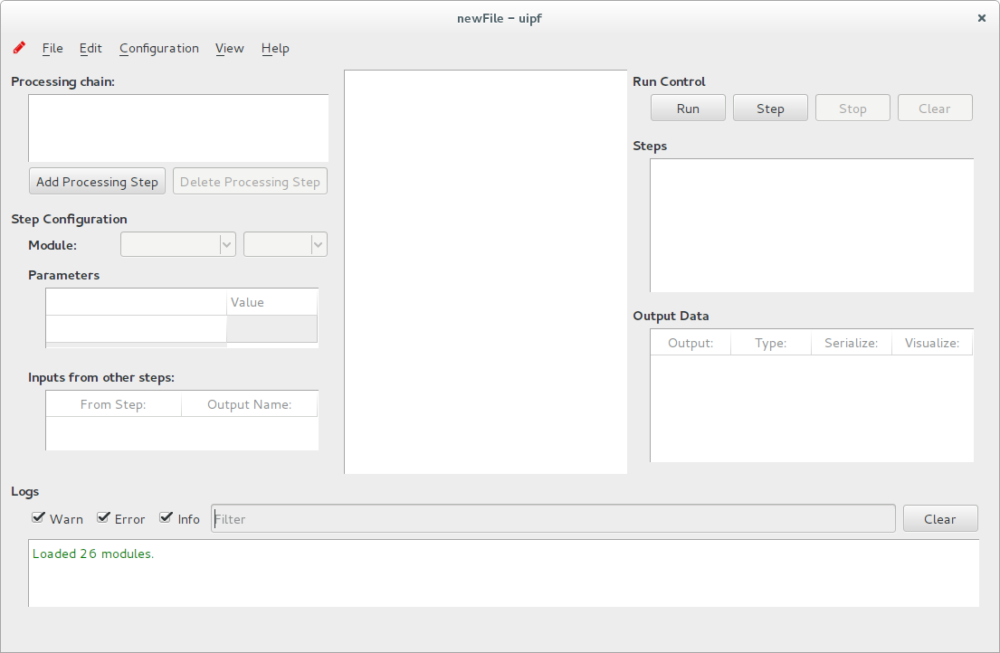
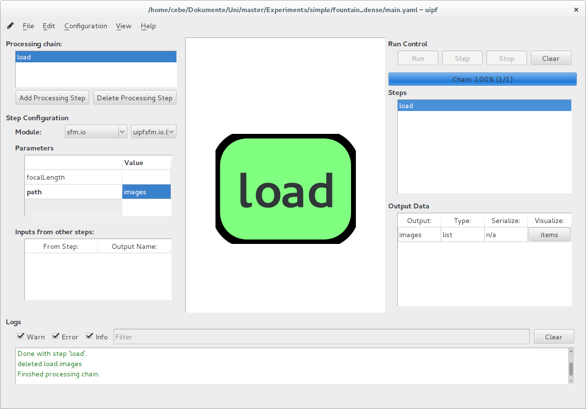
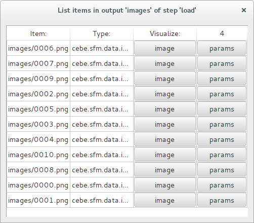
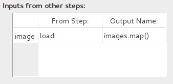
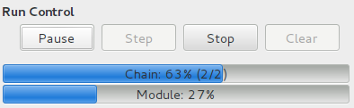
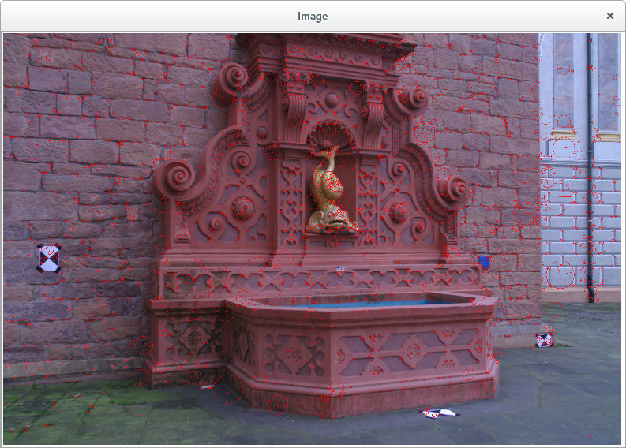
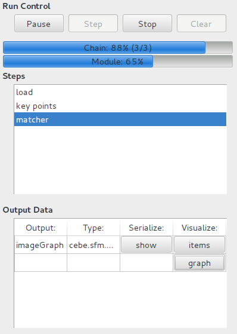
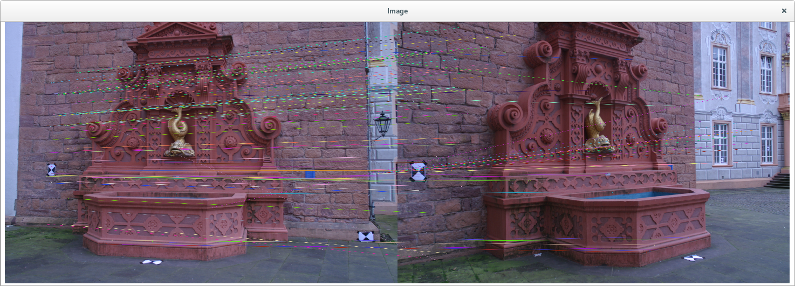
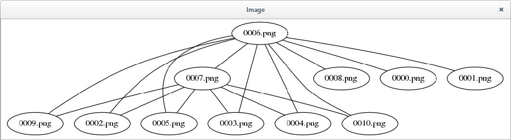
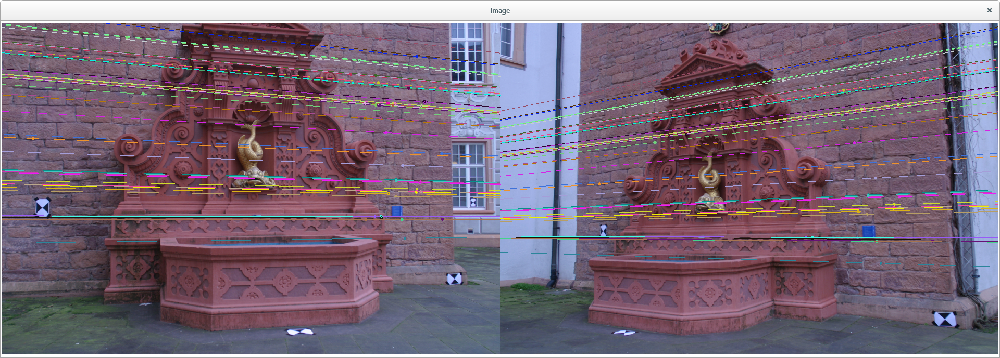

UIPF User Guide
===============

This is a quick start tutorial to explain the usage of the UIPF GUI.
It shows the creation of a processing chain by using the 3D reconstruction modules.

The following is a screenshot of the GUI:

On the right hand side we have the controls for creating a processing chain. On the left hand side are the controls for running the processing chain and inspecting the results.

To create a processing chain, first save the current project in a file.
This will define the working directory, which is needed to specify relative paths. Go to `File -> Save as...` to do this. Ideally put it into an empty directory.

> Tip: the read pencil in the upper left corner shows whether the current changes have been saved or not. After makine changes you can press `Crtl+S` to save.

Now we create a processing step to load some images by clicking "Add Processing Step" under the processing chain list and name it `load`.
Select a module category from the the first dropdown `sfm.io`, and
the module `load_images` from the second dropdown.
The module has two parameters which are now shown in the list below.
We only set the `path` to the location where the images are. The path is relative to the processing chain file. I have put some images into the `images` folder, so I set the `path` parameter to `images`.
`focalLength` can be set if the focal length is known, if not leave it empty. If the focal length is in the meta data, the load module will read it from the file.

We now have a processing chain that contains one step. We can already execute it to see how the run control works. Click "Run" on the right hand side to execute the processing chain. You can now see the `load` step has shown up in the right list for steps that have procuced output data. Selecting it should look like this:

The "Output Data" list shows the created data and provides a visualisation option called "items", which will open a window showing the list items of the image list:

Clicking on the `image` visualization option will show the loaded image. `params` shows a text view with image meta data.

If the images have been loaded sucessfully, we can now close this window and add a second step to the processing chain to do something useful.

> Tip: Opening visualisation windows can result in a lot of open windows > which takes some time to close. A fast way to close all Windows is to 
> select `View -> Close Windows` or `Ctrl+W`.

To add a second step, click "Add processing step" again. Name the new one "key points". The name does not matter but it is to remember what it is supposed to do. Select the module `sift` from `sfm.keypoint` category.

This step needs some input data to work on, so we have to select the input in the list box on the lower left called "Inputs from other steps".
We see there that the step has one input named "image". We want to apply the SIFT module to all images that are returned from the "load" step, so we select "load" in the first dropdown. The second dropdown allows the selection of "images" and "images.map()". As the input of the SIFT module is a single image and the ouput of the load step is a list of images, the `map()` operator has to be applied. Select that as the input source:

To run the processing chain again, we have to clear to previous result. Click the "Clear" button to do so and "Run" again to start the processing chain.

You can see the progress being visualized:

Once finished we have two steps that have provided output data.
The same way as done before we can visualize the data by selecting the step and data to view. The ouput of the key point step is again a list
because each item of the image list has been applied to the keypoint matching resulting in a list as output.
Selecting "key points" in the list of images, you should now see a visualisation:

You can navigate the image window by zooming with `+`, `-` and `0` for reset. You may also Zoom by pressing `Ctrl` in combination with the mouse wheel.

The next step to be added is feature matching. Select the `flann_matcher` form the `sfm.keypoint` category.

The input to select for the matcher is the `image` output of the key point step, which is a list of images because we applied the `map()` operator.

You can run the processing chain again. This may already take some time dependent on the images you have chosen. You can see the progress bar and you may pause or stop the chain if you want.
Pause will cause the chain to pause after the current step has finished.
Stop will abort the chain, this will also destroy all visualisation data. If you want to keep the data you have to use Pause and wait for a step to finish.

You may already inspect the data while the processing chain is running.
The data will be updated as soon as new data is available from the module.

The ouput of the matcher step is an image graph which allows us to visualise the realted images as well as the key point matching:

The ususally contain a lot of false matches so a method needs to be applied to remove these. Therefor we add the step RANSAC from `sfm.filters` category.

Editing a processing chain after starting a run does not change the currently active chain, so you have to "Clear" again before applying the RANSAC step.

This step computes the Epipolar Geometry between two images, which adds a new visualisation option: epipolar lines.

 
 The next step to add is the Bundler SfM step from `sfm` category, which will estimate the 3D geometry. You need to specify a `workdir` parameter in which files for bundler are generated.
 The input data will be the `imageGraph` from the `matcher` step.
 
 Do the same for the `pmvs`
 
 
 
  
